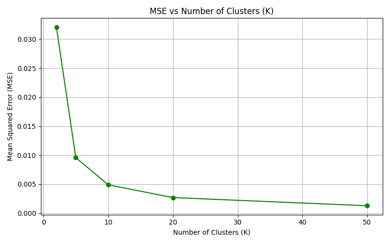

# ClusterCompress: K-Means Image Clustering

**ClusterCompress** applies K-Means clustering to reduce the number of distinct colors in an image, making it more compressible using appropriate encoding schemes. The K-Means algorithm is implemented from scratch using NumPy, and the entire project is containerized with Docker for ease of use.

---

## Features

- K-Means clustering implemented from scratch (no external ML libraries).
- Supports 512 x 512 x 3 images.
- Customizable number of clusters (`K`).
- Dockerized for simple build and execution.

---

## How It Works

1. Load and normalize the input image (scale pixel values to \[0, 1\]).
2. Reshape the image into a 2D array of RGB pixels.
3. Select the first cluster center randomly.
4. Initialize remaining cluster centers using **k-means++**:
   - Compute distances of all pixels from existing centers.
   - Normalize squared distances.
   - Use normalized values as probabilities for next center selection.
5. Assign each pixel to its nearest cluster center.
6. Update each cluster center to the mean of its assigned pixels.
7. Repeat steps 5–6 until convergence or max iterations reached.
8. Replace each pixel in the image with its corresponding cluster center.
9. Compute and display **Mean Squared Error (MSE)** between original and clustered image.

---

## Project Structure

<pre>
ClusterCompress/
├── Dockerfile              # Docker configuration for containerized execution
├── requirements.txt        # Python dependencies (NumPy, PIL, etc.)
├── .dockerignore           # Files/folders to exclude from Docker builds
├── .gitignore              # Files/folders to exclude from Git commits
├── main.py                 # Main entry point: handles image clustering
├── model.py                # K-Means clustering logic
├── utils.py                # Utilities for image I/O and evaluation
├── README.md               # Project documentation
└── image/
    └── input_image.jpg     # Sample input image (user-supplied)
</pre>

---

## Installation & Execution

### Run with Docker

**Build the image:**

```bash
docker build -t clustercompress .
```

**Run the image:**
```bash
docker run -it --rm -v $(pwd):/app clustercompress /bin/bash
```

**Run the script inside the container:**
```bash
python main.py --image ./image/input_image.jpg --num_clusters 2
```

## Notes:
1. The input image must be saved as image/input_image.jpg.
2. The output image will be saved as image/clustered_<k>.jpg.

## Command-Line Arguments

The script accepts the following arguments:

| Argument           | Type | Required | Default                    | Description                                      |
|--------------------|------|----------|----------------------------|--------------------------------------------------|
| `--image`          | str  | No       | `image/input_image.jpg`    | Path to the input image                          |
| `--num_clusters`   | int  | Yes      | —                          | Number of color clusters (e.g., 2, 5, 10, etc.)  |

## Results

Below are the Mean Squared Error (MSE) values for different values of **K** (number of clusters):

| Number of Clusters (K) | MSE                         |
|------------------------|-----------------------------|
| 2                      | 0.0321                      |
| 5                      | 0.0096                      |
| 10                     | 0.0049                      |
| 20                     | 0.0027                      |
| 50                     | 0.0013                      |

As **K** increases, the image quality improves (lower MSE), but file size may also increase depending on encoding.

| Original Image | Clustered (K=2) | Clustered (K=10) |
|----------------|------------------|------------------|
|  |  |  |


